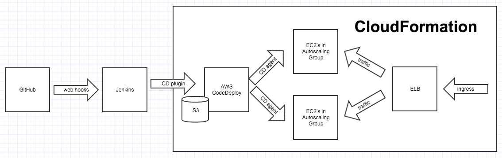

# cloud-formation-scripts

Repo to keep track of various AWS CloudFormation scripts/templates.

## S3NodeAppELBWithLockedDownAutoScaledInstances

Very basic template. 

Unzips a [hello world application](https://github.com/danwild/node-working) 
archive and runs as daemon service with node forever.

## S3NodeAppELBWithLockedDownAutoScaledInstances

More advanced template, to be used as part of a CI/CD Pipeline.
The demo project used for CodeDeploy is [ci-test](https://github.com/danwild/ci-test).

The template handles everything in the CloudFormation box below:

